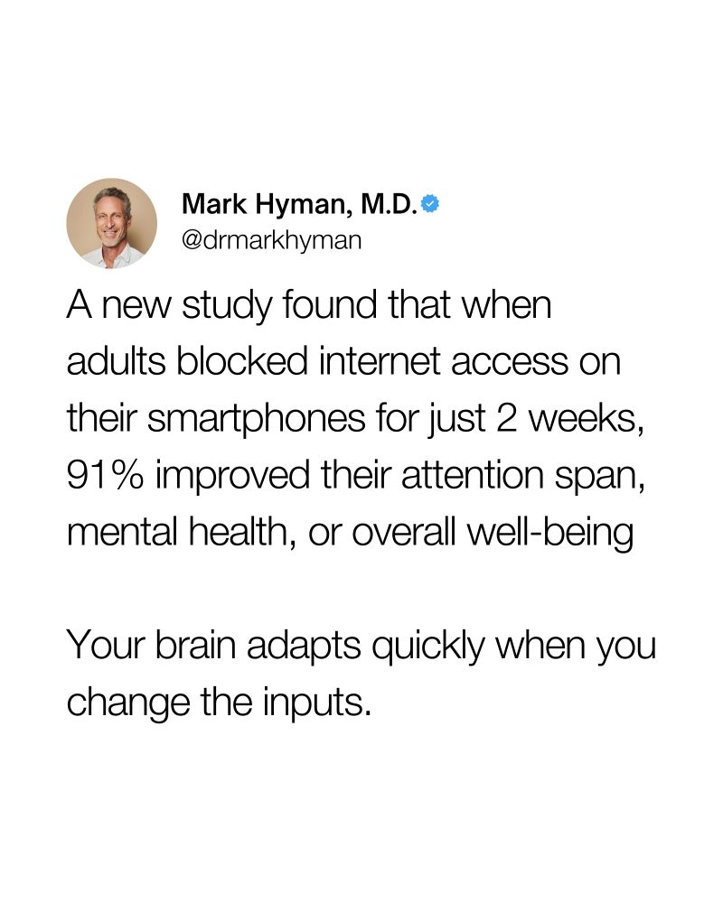

WebsiteBlocker is a free app you can use to combat social-media addiction.

What it does? Blocks access to websites you choose and only allows access during time-windows that you set. E.g., you can block Facebook and only allow access from M-F 9-10am.

**Requirements**: 

- Windows only
- capped to 3 websites
- Terminal + Admin access. No GUI
- [.NET 8.0 runtime](https://dotnet.microsoft.com/en-us/download/dotnet/thank-you/runtime-8.0.24-windows-x64-installer).

Why use WebsiteBlocker?

- Free
- Full Privacy. The program does not collect, transmit, or store any personal data or browsing history. All configuration settings and logs remain strictly local to your device.
- Lightweight (1MB download). No bloatware. Translation: It actually works.
